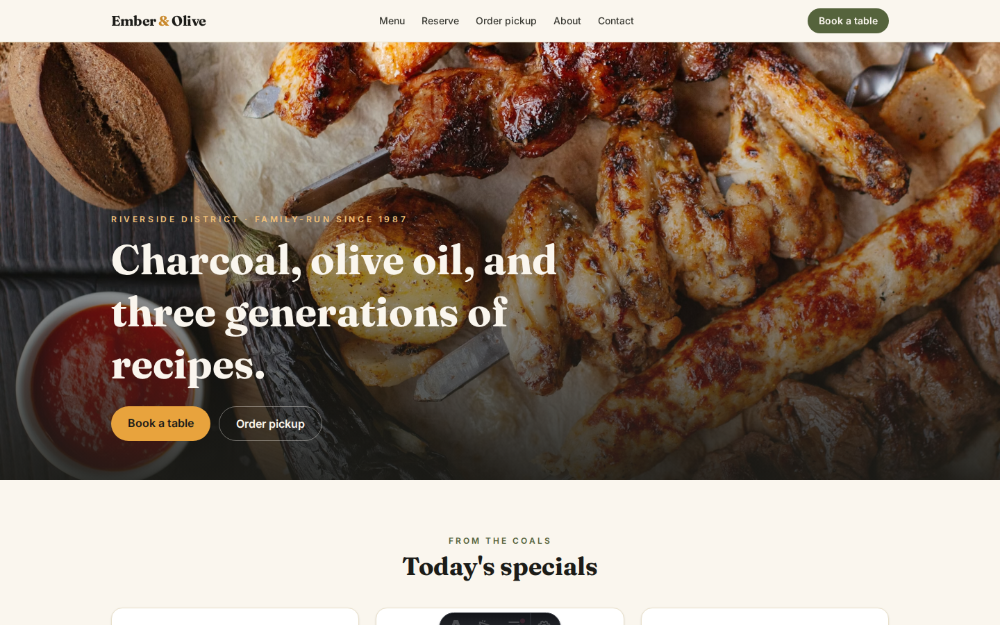
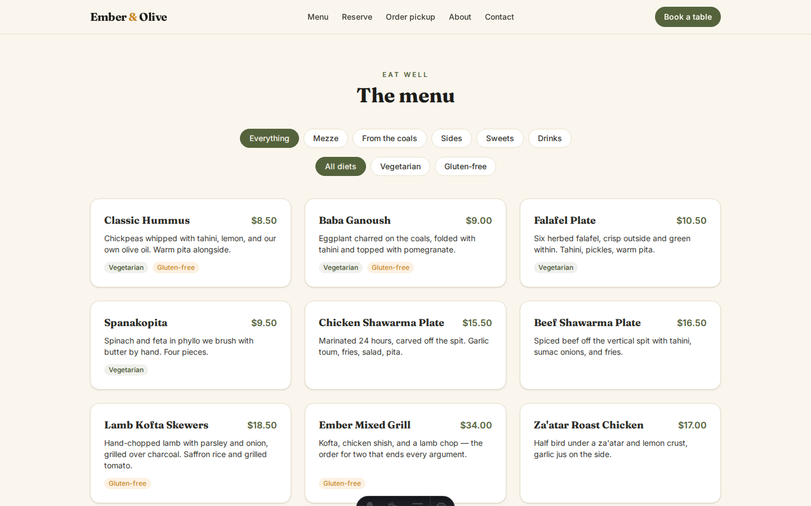
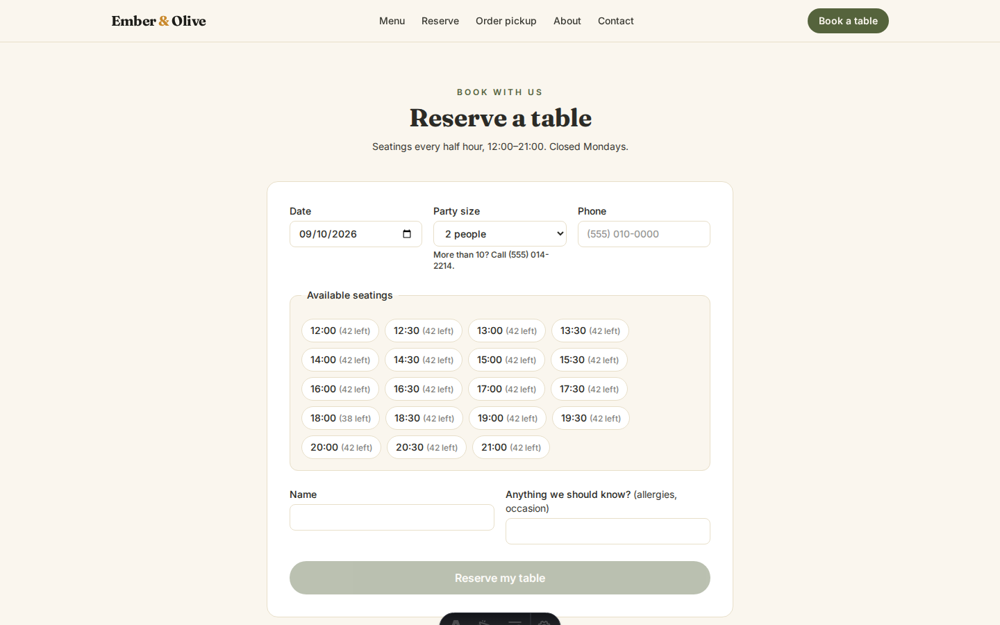
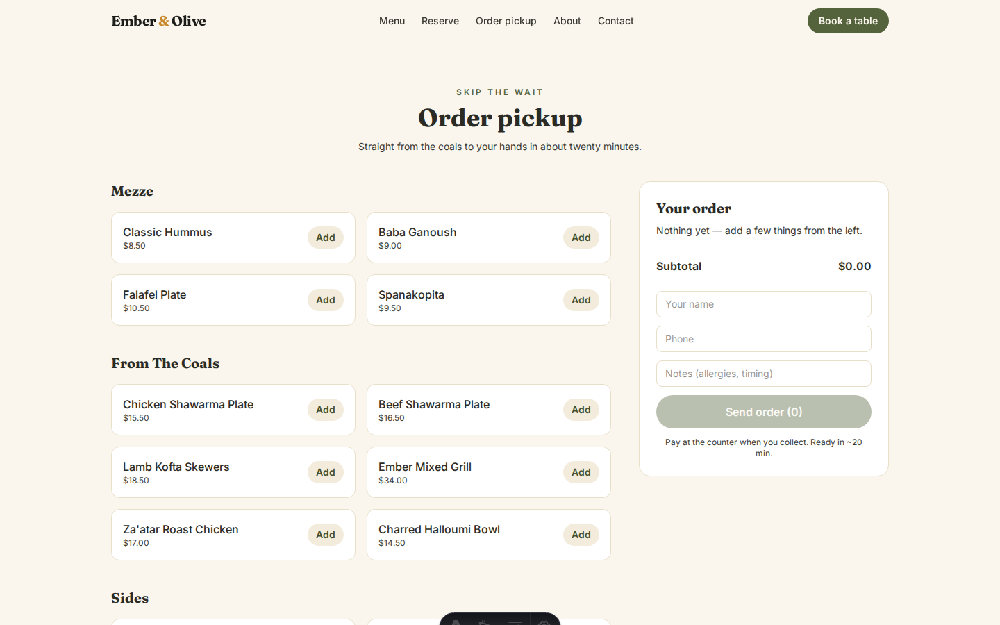
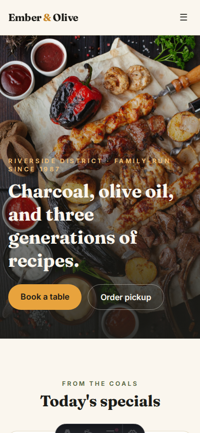

# Ember & Olive

A complete website for a fictional family-run Mediterranean grill — built the way I would build it for a paying client, then open-sourced as a portfolio piece.

**Live demo:** https://ember-olive.netlify.app *(URL finalized at deploy)*



## What it does

- **Menu** — 17 dishes across 5 courses, filterable by course and diet (React island, zero JS until you interact)
- **Reservations** — live 30-minute seatings with real capacity math (42 seats/slot), server-validated, stored in SQL
- **Pickup orders** — cart that survives reloads (localStorage), priced **server-side** from the menu, returns a real order number
- **Staff view** — `/orders` shows today's reservations and pickup tickets at a glance
- **Contact** — Netlify Forms, no backend needed

The interesting logic lives in [`src/lib/services/`](src/lib/services): per-slot capacity checks, server-recomputed prices (the client never gets to name a number), and order-number allocation with collision retry.

## Screenshots

| | |
|---|---|
|  |  |
|  |  |

## Stack

Astro 5 (static-first) · React 19 islands · Tailwind CSS 4 · TypeScript strict · Zod · Drizzle ORM + libsql (Turso in prod) · Vitest · Netlify

## Run it locally

```bash
git clone https://github.com/v01dst/ember-olive && cd ember-olive
npm install
npm run db:generate && npm run db:migrate && npm run db:seed
npm run dev        # http://localhost:4321
npm test           # vitest suites
```

Without a `TURSO_DATABASE_URL`, the app uses a local SQLite file in `data/` — no account needed for local dev.

## Project structure

```
src/
├── data/menu.json            # single source of truth for dishes + prices
├── lib/
│   ├── availability.ts       # slots, capacity, opening hours (pure, tested)
│   ├── menu.ts               # zod-validated menu loader
│   ├── validation.ts         # shared zod schemas (client + server)
│   ├── schema.ts             # drizzle tables
│   ├── db.ts                 # libsql client factory
│   └── services/             # all DB access lives here
├── components/react/         # the only client-side JS on the site
└── pages/api/                # on-demand Netlify functions
```

## Notes

- Food photos are from [Unsplash](https://unsplash.com). Everything else — code, copy, brand — is mine.
- This is a fictional business; the address, phone, and reviews are invented.

---

**Built by Mahmoud Ahmed** · open to freelance work

- Discord: `9p.1`
- LinkedIn: https://tinyurl.com/25c8fklq <!-- linkedin: https://www.linkedin.com/in/mahmoud-ahmed-8a349842b -->

## License

[MIT](LICENSE)
